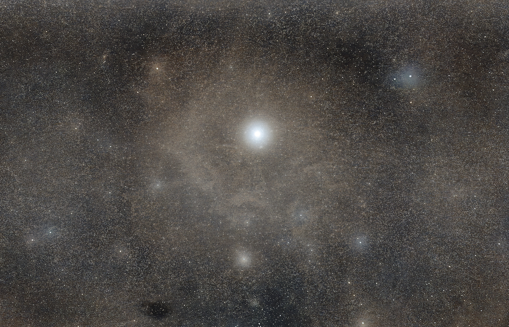

# astro-imaging-agent



**Made by Alpha Codes s.r.o.** Author and maintainer: **Ondřej Brůha**
([ondrej.bruha@alphacodes.eu](mailto:ondrej.bruha@alphacodes.eu)).

`aia` is a Python CLI and modular astronomical image-processing library. It measures
images, applies deterministic processing tools, and saves replayable YAML pipelines
with JSON processing reports. The default rule-based planner runs entirely locally.
Optional OpenAI, Anthropic and Google Gemini planners interpret natural-language goals.

The purpose of the LLM integration is **planning and orchestration**.
A generative model never modifies pixels. The processing engine accepts a validated
pipeline and remains usable independently of any agent.

## Installation

Requires Python **3.12+**. Package name: `astro-imaging-agent`; Python import:
`astroagent`; CLI command: **`aia`**.

After the first PyPI release:

```bash
python -m pip install astro-imaging-agent
aia --help
```

For development from source, see [development.md](development.md). The core runs
locally; optional LLM planners require their SDK extra and API key.

## Supported image formats

| Format | Reading | Writing | Precision and metadata |
| --- | --- | --- | --- |
| FITS (`.fit`, `.fits`, `.fts`, also `.gz`) | Mono and unambiguous RGB image HDUs | Mono/RGB | Integer or float; scientific header, WCS, COMMENT and HISTORY preserved; structural, scaling and checksum cards regenerated |
| TIFF (`.tif`, `.tiff`) | Single mono/RGB image; contiguous or planar RGB | Mono/RGB | Integer or float arrays preserved; own exports embed original metadata and the complete FITS header in ImageDescription |
| PNG | Mono/RGB, including **16-bit RGB** and opaque palettes | Mono/RGB | uint8 stays 8-bit; uint16/normalized floats export as 16-bit; lossless compression, float quantization |
| JPEG (`.jpg`, `.jpeg`) | Mono/RGB | Mono/RGB | 8-bit **lossy**, quality 95 with no chroma subsampling |
| WebP | Single mono/RGB frame | 8-bit RGB | Lossless compression; floats/uint16 quantized to 8-bit; mono exports decode as RGB |
| BMP | Mono/RGB | Mono/RGB | 8-bit, lossless compression; floats/uint16 quantized to 8-bit |

PNG/JPEG/WebP/BMP export accepts float pixels in **0..1**, or unsigned 8/16-bit
integer input scaled by its dtype range. It never silently stretches raw scientific
data in single-image tools. Add `normalize` or `stretch` before exporting an
unbounded float image. Dataset `stack` and `debayer` commands create an explicit,
recorded display stretch when a PNG/JPEG/WebP/BMP output is requested (see below).
TIFF and FITS preserve unbounded floats and negative sky-subtracted residuals.
Standard raster exports retain original metadata in the processing JSON sidecar;
they do not embed a FITS header. JPEG/WebP/BMP are display products, not scientific
intermediates. Alpha channels, animated images, TIFF stacks and non-RGB FITS cubes
are rejected with a readable error. Ordinary JPEG/WebP/BMP EXIF orientation is applied
when loading. Existing tone mapping in display images cannot be reliably inferred.

FITS RGB is internally `(height, width, 3)`. A cube without an `ASTRCHAX` card
must have exactly one end axis of length three; a cube with both end axes of length
three is ambiguous. Own exports declare the NumPy storage channel axis in
`ASTRCHAX`. Loaded FITS storage orientation is retained, preserving WCS axis mapping.

## CLI examples

```bash
aia inspect image.fit
aia inspect image.fit --json
aia analyze-background image.fit
aia analyze-stars image.fit --fwhm 3 --threshold-sigma 5

aia normalize image.fit normalized.fit
aia stretch image.fit stretched.fit --method asinh --strength 0.6
aia denoise image.fit smoothed.fit --sigma 0.8
aia background-extract image.fit corrected.fit --grid-size 8 --polynomial-degree 2
aia local-contrast stretched.fit contrast.fit --radius 12 --amount 0.3
aia color-adjust rgb-normalized.fit colors.fit --target-hue 0 --hue-width 40 --saturation 1.1
aia sharpen stretched.fit sharpened.fit --radius 1 --amount 0.4 --threshold 0.01

# The output extension selects the format.
aia stretch image.fit preview.png --strength 0.6
aia normalize photo.tiff preview.jpg
aia inspect preview.png --json

aia run examples/pipeline.yaml --input image.fit --output processed.fit
aia agent image.fit "zpracuj tento snímek přirozeně a nepřepal hvězdy" --dry-run --explain
aia agent image.fit "zpracuj tento obrázek" --output processed.fit --explain

aia tools
aia -v run examples/pipeline.yaml --input image.fit --output processed.fit
aia -vv inspect missing.fit
```

Verbosity flags precede the command: `-v` logs steps, `-vv` includes debug tracebacks.
Expected errors show `Error: ...` with exit code 1; normal execution has no debug logs.
Single-tool commands can omit the output, defaulting to `<input-stem>.processed.fit`.
Use `--overwrite` to replace output artifacts; input replacement is always refused.
`python -m astroagent` provides the same CLI.

## Pipeline and processing reports

```yaml
version: 1
steps:
  - tool: background_extract
    params:
      grid_size: 8
      polynomial_degree: 2
      sigma_clipping_threshold: 3.0
  - tool: denoise
    params:
      method: gaussian
      sigma: 0.8
  - tool: stretch
    params:
      method: asinh
      strength: 0.6
```

Every processing command saves:

```text
processed.fit
processed.pipeline.yaml
processed.processing.json
```

The saved YAML contains all **resolved defaults**, so changes in future defaults do
not change the plan. Replay it with `aia run processed.pipeline.yaml --input image.fit
--output replay.fit`. All steps and parameters are validated before processing starts;
unknown tools, misspelled fields, unsupported versions and invalid values are rejected.
The executor stops at the first failure and identifies its step number.

The JSON report contains input/output paths, package/dependency versions, pixel
SHA-256 hashes, resolved pipeline, per-step before/after metrics, elapsed milliseconds,
warnings and (for agent runs) the request, short explanations, and full analysis of
the initial/final images. Pixel hashes canonicalize data as little-endian float64
with shape; the output-file hash identifies the encoded artifact. Raster export
quantization is also measured separately. Timings are informational and vary between
runs. Replay equality requires the same inputs, tool versions, parameters and numerical
environment; cross-platform floating-point bitwise identity is not promised.

Outputs are checked for collisions before execution. Each artifact is written
atomically, but the three-file bundle is not a transaction: a disk failure may leave
a partial bundle. Ordinary image runs save only final artifacts; dataset and agent
runs retain intermediate workspaces as described below.

## Architecture

```text
src/astroagent/
  models/       ndarray-based AstroImage and shared strict schema model
  io/           FITS/raster adapters and metadata handling
  analysis/     finite statistics, robust background, photutils stars, quality
  tools/        typed deterministic tools and immutable per-executor registry
  pipeline/     Pydantic definitions, YAML/JSON, executor and execution history
  agent/        planner protocols, rules, and analysis/plan/execute orchestration
  cli/          Typer argument parsing, presentation and error boundary
```

The central boundary is:

```text
Planner -> PlanResult(PipelineDefinition, explanations)
       -> PipelineExecutor -> ImageTool -> ToolResult
```

`PipelineExecutor` does not import the agent layer. `AstroImage` is a dataclass so
large NumPy arrays do not pass through Pydantic. Schemas, metrics, plans and reports
use Pydantic v2. Dataset algorithms and new display edits primarily use float32;
existing image tools and accumulation use float64 where useful. Tools return new arrays, copy metadata/headers,
and provide before/after metrics and warnings. There is no global mutable registry.
SciPy supplies Gaussian filtering and NumPy supplies polynomial fitting; scikit-image
is not needed for this implementation. Optional future backends (OpenCV, CuPy,
PyTorch, SEP, astroalign, ccdproc) can live behind new tools/adapters.

## Analysis and numerical behavior

- `inspect` reports dimensions `(height, width)`, channels, dtype, finite min/max,
  mean/median/std, percentiles 1/5/50/95/99, saturation and JSON-safe metadata.
  RGB summary values aggregate channel samples. NaN/Inf are excluded with a warning;
  Inf and entirely invalid images cannot be processed. Mask-aware tools advertise
  `supports_nan` and preserve the exact NaN mask; denoise requires finite input.
- Saturation uses `SATURATE`, then the integer dtype ceiling, or 1 for bounded float
  images. Otherwise its fraction is `null` with a warning. It counts **channel samples**,
  not whole RGB pixels. A normalized maximum is not evidence of physical detector
  saturation; saturation fractions after stretching are display-range measurements.
- Background uses sigma-clipped tile medians and a fitted plane. `sigma` is clipped
  residual noise; `gradient_estimate` is the fitted surface's 95th–5th percentile
  range in input units. RGB analysis uses equal-weight channel averaging.
- Stars use photutils `DAOStarFinder`. Positive local second moments give approximate
  Gaussian FWHM in pixels, ellipticity `1-b/a`, and eccentricity `sqrt(1-(b/a)^2)`.
  Failed detection or unreliable shapes return `null` and warnings. This is a rough
  quality indicator, not precision PSF fitting or calibrated photometry.
- Normalize uses one global min/max scale across RGB; constant images map to the
  lower endpoint. The target interval must satisfy `0 <= lower < upper <= 1`.
- Stretch also uses global endpoints. `black_point` is in input units and must be
  below the maximum. `linear` ignores strength; `asinh` uses
  `gain = 10**(3*strength)-1` and `asinh(gain*x)/asinh(gain)`, with strength zero
  reducing to linear. Strength is in 0..1. Explicit black points can clip shadows.
- Gaussian denoising uses reflected spatial edges and never mixes RGB channels.
  It softens stars; the report makes that limitation explicit.
- Background extraction subtracts a total-degree 0–3 polynomial from each channel
  independently. It removes offset as well as gradient and preserves negative
  values. Extended nebulosity, gradients within tiles and crowded fields can bias
  automatic samples; rank-deficient grids are rejected. It is not a full DBE tool.
- `local_contrast` boosts luminance differences from a broad Gaussian mean. Its
  default highlight/shadow taper is `4*L*(1-L)`, limiting black-sky and bright-star
  halos. `sharpen` uses an unsharp mask with soft thresholding to avoid boosting
  small noise residuals; highlight protection tapers by `1-L**4`. Both use the same
  luminance ratio on RGB channels and normalized convolution around NaN coverage.
- `color_adjust` changes RGB gains, HSV saturation and hue globally or inside a
  cosine-weighted circular hue band. Hue and width are degrees: red 0, green 120,
  blue 240. Achromatic pixels are excluded from selective edits. Detail and color
  tools require 0..1 samples; normalize/stretch first. They clip display endpoints,
  can amplify noise/ringing, and do not perform deconvolution or photometric calibration.
  Color edits preserve incomplete RGB pixels rather than invent missing channels.

## Agent flow

`AutonomousAgent` powers `aia agent` for individual images and complete sessions.
It inspects inputs, obtains a validated plan, executes it, measures the result and
requests another plan. Each round may compare the primary pipeline with up to two
alternatives from the same current input, accept one and continue. Session tools
can run together or across rounds: build masters, calibrate, debayer, register and
stack without manual intervention. The final accepted steps form one offline
replay pipeline. The lower-level `AgentExecutor` remains available for one-plan calls.

`--max-iterations` defaults to 3 (maximum 20); `--max-candidates` defaults to 3.
The agent stops on an empty plan, repetition, unchanged pixels, failed candidates,
an excessive measured quality decline, or its iteration limit. Failed replanning
preserves an already accepted image. A run ending with an uncombined dataset fails
explicitly; increase the limit when a planner splits a session into many rounds.
`--dry-run` displays only the initial plan without files; `--explain` displays short
user-facing reasons. API planning can require one call per round.

Image alternatives use the transparent heuristic
`0.4*range/(range+10*noise) + 0.35/(1+gradient/range) + 0.25*(1-saturation)`,
where range is P99-P1. Dataset candidates use mean available frame quality. This
score measures numerical proxies, not aesthetic or photometric correctness, and
can favor smoother images. After the first accepted image, a drop over 0.03 retains
the previous result (`AgentOptions.quality_drop_tolerance` configures it). Inspect
previews for faint detail and star preservation.

`<output-stem>.agent/` stores attempted YAML pipelines, candidate FITS/workspaces,
measurements, errors and `iterations.json`, including rejected alternatives. The
final processing report includes the complete attempt history, accepted steps,
resolved parameters and stopping reason. These artifacts may consume substantial disk.
Bounded agent images export directly to display formats; unbounded scientific masters
receive the recorded common asinh mapping. Invalid coverage is black only in display
exports, and remains NaN in FITS/TIFF. Raw CFA single images require calibration and
debayer first; give the agent a session directory for autonomous OSC preprocessing.

`RuleBasedPlanner` compares gradient/noise against the robust 99th–1st percentile
range: gradient over 15% selects a degree-1 background model, noise over 8% selects
mild Gaussian denoising, and a dark median suggests an asinh stretch. `ASTRSTR`
marks images stretched by this tool. Out-of-range non-linear images are normalized.
Constant images have empty plans. Only advertised tools can be selected.

Rules understand limited English/Czech keywords for contrast, color and sharpening;
they otherwise plan from measurements and preserve a scientific stack unless display
edits were requested. Free-form goal interpretation uses an optional existing LLM
provider. Thresholds and linearity inference are heuristics; inspect the report.
`LLMPlanner` provides the common boundary for `OpenAIPlanner`, `AnthropicPlanner`
and `GeminiPlanner`; each returns the same validated `PlanResult` and has no access
to image arrays or engine internals.

## LLM planners

Install only the provider you need, or all three:

```bash
python -m pip install 'astro-imaging-agent[openai]'
python -m pip install 'astro-imaging-agent[anthropic]'
python -m pip install 'astro-imaging-agent[gemini]'
python -m pip install 'astro-imaging-agent[llm]'
```

Set `OPENAI_API_KEY`, `ANTHROPIC_API_KEY`, or `GEMINI_API_KEY` in your environment.
Choose a model ID available to your account explicitly; no model is hardcoded:

```bash
aia agent image.fit "preserve stars and bring out faint detail" --provider openai --model YOUR_GPT_MODEL --dry-run --explain
aia agent image.fit "natural processing" --provider anthropic --model YOUR_CLAUDE_MODEL --output processed.fit
aia agent image.fit "remove the sky gradient" --provider gemini --model YOUR_GEMINI_MODEL --dry-run
```

`--provider rules` is the default. `--timeout` controls SDK request timeout (default
60 seconds). LLM dry-run calls the selected provider to generate a plan but never
writes or processes an image. The provider receives the request, image measurements,
metadata and tool schemas; image pixels/files and API keys are not included in the
planning payload. The report records provider and model, while the saved YAML replays
offline with `aia run`. Planning itself can vary between API calls.

The model receives an **AIA usage guide** in its system prompt, live tool descriptions
and parameter schemas, session/image measurements, and later execution feedback
(previous plans, errors, scores and metrics). It returns `PlanResult` JSON containing
a primary pipeline and optional alternatives, never shell commands or pixel edits.
The guide explicitly requires calibration before debayering and prohibits inventing
CFA patterns. See [src/astroagent/agent/prompts.py](src/astroagent/agent/prompts.py).

```bash
aia agent ./session "zpracuj celou session a vytvoř kvalitní master" --output master.fit
aia agent image.fit "zvýrazni lokální kontrast a jemně doostři" --output preview.jpg --max-iterations 5
aia agent ./session "stack and enhance faint detail, preserve stars" --provider openai --model YOUR_GPT_MODEL --output result.tiff --max-iterations 5
```

OpenAI uses [Responses JSON mode](https://developers.openai.com/api/docs/guides/structured-outputs),
Claude uses a [forced plan-submission tool call](https://platform.claude.com/docs/en/api/python/messages/create),
and Gemini uses [Google GenAI JSON generation](https://github.com/googleapis/python-genai).
Extensible parameter dictionaries are checked locally with Pydantic and the registry;
provider JSON mode alone does not guarantee schema validity. Malformed, incomplete,
unknown-tool or invalid-parameter plans are rejected before processing. There is no
automatic fallback to rules when an API call fails. API errors omit SDK response
bodies; keys are read from the environment and are never written to artifacts.
Tests use fake clients and do not make paid API calls.

## Calibration, registration and stacking

Installed-package users invoke `aia` directly. Poetry is used only for local development; see [development.md](development.md).
Sessions and dataset commands read FITS files; TIFF and display formats are export
products. The complete numerical workflow runs offline:

```text
raw lights + bias/dark/flat frames
  -> compatible calibration masters
  -> floating point light calibration
  -> debayer when raw CFA metadata is present
  -> frame analysis and best reference
  -> star matching, robust registration
  -> frame rejection and weighted sigma-clipped combination
  -> master FITS + processing JSON + replay YAML
```

Bias measures the camera readout offset. Dark measures thermal current and fixed
sensor signal at a given exposure, gain and temperature. Flat measures pixel-response
differences and optical vignetting. Subtract bias/dark before dividing by a normalized
flat. If the dark contains bias, subtract the dark alone; never subtract bias twice.

An example session:

```text
session/
├── lights/light_001.fit
├── darks/dark_001.fit
├── flats/flat_L_001.fit
└── bias/bias_001.fit
```

```bash
aia session inspect ./session --json
aia calibrate ./session --dry-run --explain
aia master build ./session --output ./work/masters
aia calibrate ./session --output ./work/calibrated
aia analyze-frames ./work/calibrated
aia select-reference ./work/calibrated --json
aia register ./work/calibrated --reference auto --output ./work/registered
aia stack ./work/registered --method weighted-sigma-clipped --output ./work/master.fit

# All steps, including master building, plus a replay pipeline:
aia process ./session --output ./work/result
aia run ./work/result/master.pipeline.yaml --input ./session --output ./work/replay.fit

# Prepared frames can be registered and stacked together:
aia stack ./lights --register --reference auto --output ./work/master.fit

# Generate a small local fixture; no example sky datasets need downloading.
python examples/make_synthetic_session.py ./example-session --osc
aia process ./example-session --output ./work/example
```

Session discovery uses the first image HDU, normalizing IMAGETYP/FRAME/OBSTYPE,
EXPTIME/EXPOSURE, GAIN/CCD-GAIN, OFFSET/BLKLEVEL, CCD-TEMP/SET-TEMP, FILTER,
binning and Bayer aliases. EGAIN (electrons/ADU) is not treated as camera gain.
Explicit frame type wins over directory names, then conservative filename tokens.
Unrecognized types are UNKNOWN with a warning. Missing metadata stays unknown.
Known dimensions, sampling, gain and offset conflicts prevent master selection;
unknown gain/offset produce warnings. Mixed filters should be processed as separate
registration/stacking datasets, after their filter-specific calibration.

Bias masters are grouped by dimensions, layout/CFA phase, binning, gain and offset.
Darks additionally group by exact exposure and temperature rounded to 0.1 C; flats
add the exact filter name. Each group produces a distinct file, with ordinal prefixes
to prevent filename collisions. Darks at the same exposure use the closest available
temperature; differences over 3 C warn. A missing calibration type is permitted;
an available but incompatible type causes that light to fail with an explicit reason.

Master bias/dark/flat support mean, median and sigma-clipped mean (the default).
Bias is subtracted from each dark before combination. Flats subtract compatible bias
and, when available at the same exposure, dark/dark-flat, normalize each input, combine,
then normalize the master. Frame-level rejection is conservative: more than eight MAD
in median or noise for groups of at least five, or over 10% saturation for flats.
The sidecars include measurements, chosen corrections and rejection reasons.

```bash
aia master bias ./bias --output master-bias.fit
aia master dark ./darks --bias master-bias.fit --output master-dark.fit
aia master flat ./flats --bias master-bias.fit --output master-flat.fit
aia calibrate ./lights --bias master-bias.fit --dark master-dark.fit --flat master-flat.fit --output ./calibrated
aia calibrate ./lights --dark master-dark.fit --scale-dark --cosmetic-correction --output ./calibrated
```

Own master darks declare `DCBIAS` (contains bias). Foreign darks must supply that
card or an explicit `--dark-contains-bias` / `--dark-no-bias` choice. Exposure
scaling is off by default; mismatched dark exposure is an error. Explicit scaling
uses light/dark exposure ratio. Scaling a bias-containing dark requires a master
bias to isolate thermal current first. This assumes linear dark current and can
fail for amp glow or sensor nonlinearities; there is no thermal scaling model.

Calibration retains negative floating point values. Flat response below
`--flat-min-fraction` (default 0.05 of its median), zero and nonfinite response
produce NaN. Over 20% invalid flat samples fails by default. Reports compare
before/after statistics, saturation and NaN fractions. Optional cosmetic correction
finds dark pixels above median + 8×1.4826×MAD and replaces only those samples with
neighbor medians; CFA neighbors belong to the same phase. Cold maps remain an
extension point. Saturation for floats requires a SATURATE header; an unknown
floating-point camera ceiling is not invented.

### Mono and OSC/CFA

Mono stays two dimensional. Raw OSC/CFA frames stay in their sensor domain through
bias/dark/flat calibration, including separate flat normalization for R/G1/G2/B.
**Calibrate before debayering.** Bayer patterns RGGB, BGGR, GRBG and GBRG and
XBAYROFF/YBAYROFF offsets are supported. Bilinear reconstruction applies finite-sample
kernels with explicit boundary handling, outputs channel-last RGB and marks DEBAYER.
No white balance or photometric color calibration is performed. A declared OSC image
without its pattern fails; unmarked 2D images are treated as mono. Supply
`--cfa-pattern` when the camera's headers lack that information; patterns are never guessed.
This explicit override also applies to mono calibration masters; each frame retains
its own declared Bayer offsets.

```bash
aia calibrate ./session --cfa-pattern RGGB --output ./calibrated
aia calibrate ./session --no-debayer --output ./calibrated-cfa
aia debayer ./calibrated-cfa/light.fit --pattern RGGB --output rgb.fit
```

### Registration and quality

Star detection uses Photutils DAOStarFinder above a sigma-clipped, fitted sky surface,
with default threshold 5 times background noise. It measures centroid, flux, peak,
moment-based Gaussian FWHM and eccentricity, excluding masked/saturated/border cutouts.
RGB detection uses equal-channel luminance; each color receives the same transform.

Matching compares local triangle side-length ratios among the 100 brightest sources.
Canonical vertices initialize similarity hypotheses before unique nearest-neighbor
pairing in transformed coordinates. Seeded RANSAC rejects false pairs and refits a
forward target-to-reference 3×3 homogeneous matrix in zero-based x/y pixels. The
default similarity model fits translation, rotation and uniform scale; `--model affine`
also permits shear and anisotropic scale. At least six matches/inliers, at least
50% inliers, RMS at most one pixel and scale 0.8..1.2 are default eligibility limits.
All limits are configurable through `RegistrationParams`/pipeline YAML; frequently
used limits are CLI options. Nearest, bilinear and bicubic (default) resampling
preserve NaN coverage. Registered outputs use reference WCS and preserve acquisition
metadata. Failed frames remain explicit in `registration.json`.

Interactive `calibrate` and `register` show progress on stderr; `-v` logs frame
counts and pipeline steps for full workflows. JSON stdout remains machine-readable.

Quality is a weighted sum of dataset percentile ranks: FWHM 0.30, eccentricity 0.20,
background sigma 0.20, star count 0.20, saturation 0.10. More stars are better; all
other components lower are better. Ties get average ranks, a constant component gets
0.5, missing components zero. Reference selection chooses the highest score with
enough stars and breaks ties by path. **Scores are relative to the current dataset**,
not calibrated probabilities or comparable scores between sessions. Different
exposures or sky brightness can bias the noise ranking.

### Stacking and export

Methods: `mean`, `median`, `weighted`/`weighted-mean`, `sigma-clipped`, and
`weighted-sigma-clipped` (default). Quality weights are max(score, 0.01), normalized
to sum to one; uniform weights are available through `UniformWeight`. Each pixel
renormalizes surviving weights after NaN and clipping rejection. Clipping iterates
median ± sigma×1.4826×MAD with independent low/high limits and at most five iterations.
Global intensity normalization matches per-channel medians and 5..95 percentile
spans to the reference (or first frame); `--no-normalize` preserves input intensities.
This is a simple intensity heuristic, not photometric or gradient matching.

```bash
aia stack ./registered --reject-worst 10% --output master.fit
aia stack ./registered --min-quality 0.5 --max-fwhm 5 --max-eccentricity 0.7 --output master.fit
aia stack ./registered --sigma-low 3 --sigma-high 3 --max-iterations 5 --no-normalize --output master.tiff
aia stack ./registered --output preview.jpg
aia stack ./registered --output preview.png
```

FITS and TIFF retain float32 scientific samples including negatives and NaN. Dataset
PNG/JPEG/WebP/BMP export maps the common finite min..max range through
asinh(10*x)/asinh(10), fills invalid coverage black and records the transform in the
processing sidecar. PNG is 16-bit, JPEG is lossy 8-bit. Keep a FITS/TIFF master for
further analysis; display exports are not numerical replacements.

Stacking spools float32 samples to a temporary memory-mapped cube and combines row
tiles (default 128 rows, approximate 256 MB working budget). It never holds all frames
in RAM. Disk requirement is approximately N×H×W×channels×4 bytes; RAM still includes
individual images, output and clipping/interpolation temporaries. Summation is float64,
saved data float32. Analysis and correction are separate passes; pixel spooling reads
each corrected input once. All reported durations are informational; RANSAC seed
defaults to zero and all resolved parameters are saved.

### Dataset APIs, pipelines and planning

The public modules separate responsibilities:

- `calibration.session`: `discover_session`, `normalize_metadata`, `group_frames`.
- `calibration.masters`: `build_master`, `build_masters`, `normalize_flat`.
- `calibration.engine`: `calibrate_image(image, CalibrationPlan, bias=..., dark=..., flat=...)`.
- `calibration.debayer`: `debayer_image(image, CFAMetadata)`.
- `registration.stars/matching/transform/resample`: catalogs, matching, fitting and resampling.
- `registration.engine`: `analyze_frames`, `register_frames` on `AstroDataset` paths.
- `stacking.stack`: `combine_pixels` for a tile, `combine_images` for an image iterator.
- `stacking.workflow`: `stack_frames`, `save_stack`; weighting and rejection are separate modules.

`AstroDataset` carries path lists, catalogs, quality, registration and master models;
it never disguises a dataset as an image's metadata. `DatasetTool` receives an explicit
artifact context and returns a dataset or combined image. Existing `ImageTool` stays
independent and may follow `stack_frames` when its finite-input requirements hold.
Saved pipelines execute with directory `--input`, no agent or provider is required.
For dataset-output pipelines, final frame paths are listed in `processing.json` inside
the output workspace. The registry exposes `input_kind` and validated parameter schemas.

See [examples/session-pipeline.yaml](examples/session-pipeline.yaml) for all steps.
Independent registry tools also include `build_master_bias`, `build_master_dark`,
`build_master_flat`, `build_masters`, `calibrate_frames`, `debayer_frames`,
`register_frames` and `stack_frames`.

```bash
aia run examples/session-pipeline.yaml --input ./session --output ./work/master.fit
aia agent ./session "zpracuj celou session a vytvoř kvalitní master" --dry-run --explain
aia agent ./session "zpracuj celou session" --output ./work/agent-master.fit
```

Dataset planning receives counts, normalized session metadata, prepared-frame quality,
selected reference and existing registration diagnostics. Rules use these measurements;
the existing optional LLM providers can select the same tools using this pixel-free
payload. Neither planning route executes numerical calibration or registration.

## Contributing

See [development.md](development.md) for Poetry setup, test commands, adding tools,
versioning, and PyPI/GitHub release configuration.

## MVP scope and next steps

Implemented: multi-format I/O, independent image and dataset tools, calibration,
CFA-aware flats, bilinear debayering, reference selection, triangle/RANSAC registration,
tiled stacking, rejection, local contrast/selective color/sharpening, offline YAML
replay and iterative pixel-free workflow planning with alternative pipelines.

Limitations: star moments are approximate and blends/nebulosity can bias detection.
Triangle initialization assumes near-similarity geometry; large shear/distortion,
very sparse or repeated patterns may fail. Bicubic interpolation can overshoot and
conservative NaN masks reduce coverage around holes. Sigma clipping is fragile with
fewer than five samples; zero MAD rejects all nonmedian values. Low-SNR intensity
normalization can follow noise rather than transparency. A single input frame still
needs to fit RAM. Flat normalization is phase/channel based, not a color calibration.
Master metadata must be checked when camera headers are missing or ambiguous.

Not included: overscan, amp-glow modeling, plate solving, mosaics, distortion warping,
drizzle, photometric/gradient normalization, neural processing, GPU or distributed
execution. Next: validate against real mono/OSC sessions with known camera metadata,
add coverage/variance maps and improve crowded-field matching and demosaicing.

## License

Apache License 2.0. See [LICENSE](LICENSE) and [NOTICE](NOTICE).
